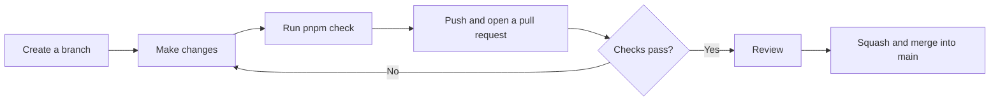
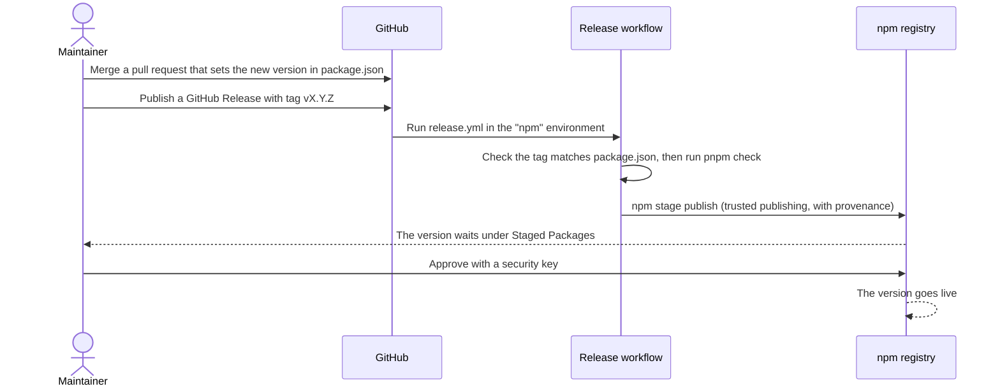

# Contributing to statinfer

Thanks for your interest in statinfer! Bug reports, suggestions, documentation fixes and new statistical tests are all welcome.

## Ways to contribute

- **Report a bug.** Open an issue with the data you used, the options you passed, the result you got, and the result you expected. If possible, include the same calculation from SciPy, statsmodels or R, so we can compare.
- **Suggest a feature.** Open an issue describing the test or option, with a link to a reference that defines it.
- **Improve the docs or demo.** Small fixes can go straight to a pull request.
- **Add a statistical test.** Please open an issue first, so we can agree on the design before you write code.

For security problems, please **don't** open a public issue. See [SECURITY.md](SECURITY.md) instead.

## Project layout

| Path | What it contains |
| --- | --- |
| `src/` | The library's source code, one file per test |
| `test/` | Vitest tests, plus `smoke.mjs`, which checks the built package |
| `test/fixtures/` | Reference results generated from SciPy and statsmodels |
| `scripts/` | The Python script that generates those fixtures (a uv project) |
| `stubs/` | Build-time stand-ins, e.g. a no-op `debug` used when bundling stdlib |
| `demo/` | The Next.js demo site, deployed at https://statinfer.vercel.app/ |
| `.github/` | CI, release and security workflows, and Dependabot settings |

## Setting up

You'll need:

- **Node.js 22 or newer.** The repo includes a `.node-version` file, so version managers like [fnm](https://github.com/Schniz/fnm) pick the right version automatically.
- **pnpm**, at the version pinned in `package.json`. Run `corepack enable pnpm` once, and Node's Corepack will provide it.
- **[uv](https://docs.astral.sh/uv/)**, only if you need to regenerate the reference fixtures.

Then:

```sh
git clone https://github.com/leehart3000/statinfer.git
cd statinfer
pnpm install
pnpm check
```

## Checks

`pnpm check` runs everything CI runs for the library, in order:

| Command | What it checks |
| --- | --- |
| `pnpm lint` | Code style (ESLint) |
| `pnpm build` | Builds the bundled package into `dist/` (tsdown) |
| `pnpm typecheck` | Types in both `src/` and `test/` |
| `pnpm test` | All tests (Vitest) |
| `pnpm test:dist` | That the built package loads with both `import` and `require` |
| `pnpm docs:api` | That the API docs build, with every export documented (TypeDoc) |

`pnpm demo:check` installs, lints and builds the demo.

## How accuracy is checked

Every test is compared against an established implementation, to about 10 decimal places:

1. `scripts/generate_fixtures.py` runs each case through SciPy or statsmodels.
2. It saves the inputs and expected results as JSON in `test/fixtures/`.
3. The Vitest tests run the same inputs through statinfer and compare.

To add or change cases, edit the Python script and run `pnpm fixtures`, then commit the updated JSON. **Never edit the fixture JSON by hand**: it must always come from the reference implementation.

## Adding a statistical test

1. Open an issue to agree on the design.
2. Add `src/<name>.ts`, taking a single options object and returning a `TestResult`. Use `null` for fields that don't apply, and throw a `RangeError` or `TypeError` with a clear message for invalid input.
3. Document every export with `/** ... */` comments. `pnpm docs:api` fails if anything is undocumented.
4. Export the function and its options type from `src/index.ts`, and add its name to the list in `test/smoke.mjs`.
5. Add reference cases to `scripts/generate_fixtures.py`, then run `pnpm fixtures`.
6. Add `test/<name>.test.ts`, with the fixture comparisons plus tests for invalid input.
7. Add the test to the table in `README.md`.

For special functions (distributions, incomplete beta and gamma, and so on), use [stdlib](https://github.com/stdlib-js/stdlib) packages rather than writing your own. Add them with `pnpm add -D`: they're bundled into the build, so statinfer keeps **zero runtime dependencies**.

## Branches and pull requests

`main` is protected: every change goes through a pull request, and the CI and secret-scanning checks must pass before merging. Pull requests are squash-merged, so each one becomes a single commit on `main`.



Each pull request is also checked by Snyk (dependencies and code), and gets a Vercel preview of the demo.

## Releases

Releases are made by maintainers. Publishing uses npm's [trusted publishing](https://docs.npmjs.com/trusted-publishers/), so no npm token is stored anywhere, and every version is **staged** and must be approved by a maintainer with two-factor authentication before it goes live.



## Security practices

- Never commit secrets. GitHub push protection and a TruffleHog workflow scan every push and pull request.
- Dependabot proposes dependency updates weekly, and Snyk checks dependencies and code on every pull request.
- The Snyk and Vercel GitHub apps have write access to this repository, which is broader than they strictly need. The main safeguard is that a new npm version can't go live without a maintainer's approval with a security key.

## Licence

statinfer is licensed under the [Apache License 2.0](LICENSE). By contributing, you agree that your contributions are licensed under the same terms.